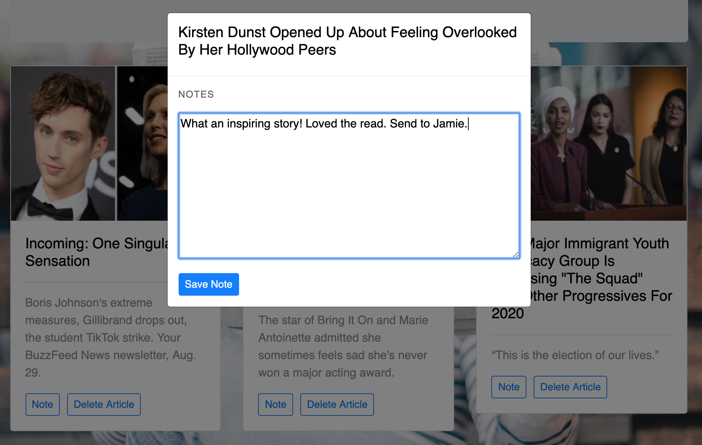

# mongoose-article-scrape

## Contributor
Jenni Birsan //
IG: jennibirsan

## About
This mongoose article scraper grabs articles from Buzzfeed News and places them on this webpage. Once you scrape the articles, they are saved to the mongoDB. You can save these articles and access them later in the "Saved Articles" landing page. In the Saved Articles landing page, you can add notes to the article and you can delete it from your saved queue. 

## Modules Used
Moment,
Node Express,
Body Parser,
Logger,
Mongoose,
Request,
Cheerio

## Database Used
mLab MongoDB connected to Robo 3T

## Heroku Link
https://jb-mongo-article-scraper-live.herokuapp.com/

## Home Page
(this is the webpage before scraping articles)

## Once Articles are Scraped
(this is the webpage after scraping articles // once you click the Get Articles Button)

## Saved Articles Page
(saved articles landing page)

## Adding a Note
(picture of when you add a note)

## Deleting Article
(picture of saved articles after deleting one of the news articles)

## Database
(picture of the database)

